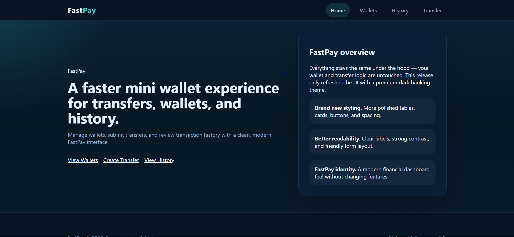
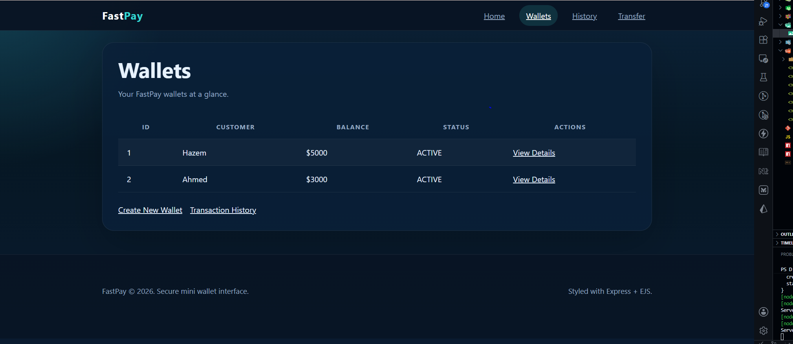
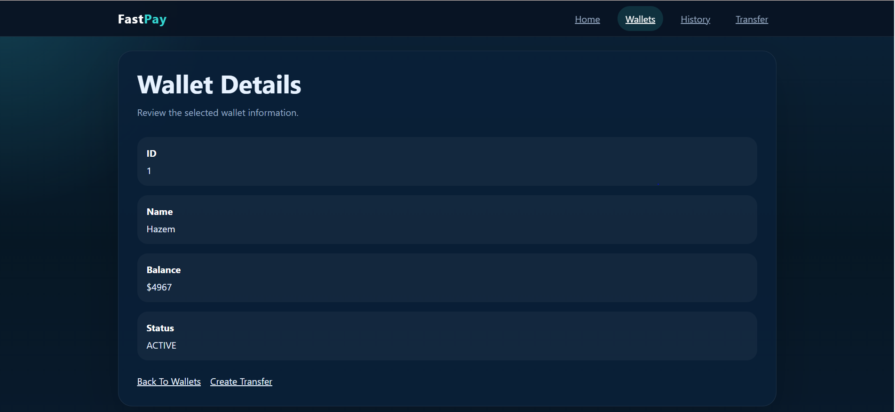
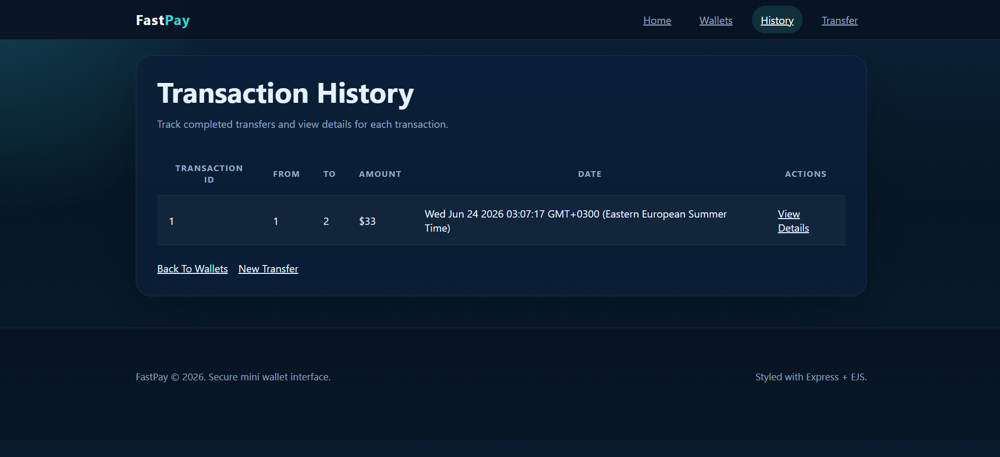
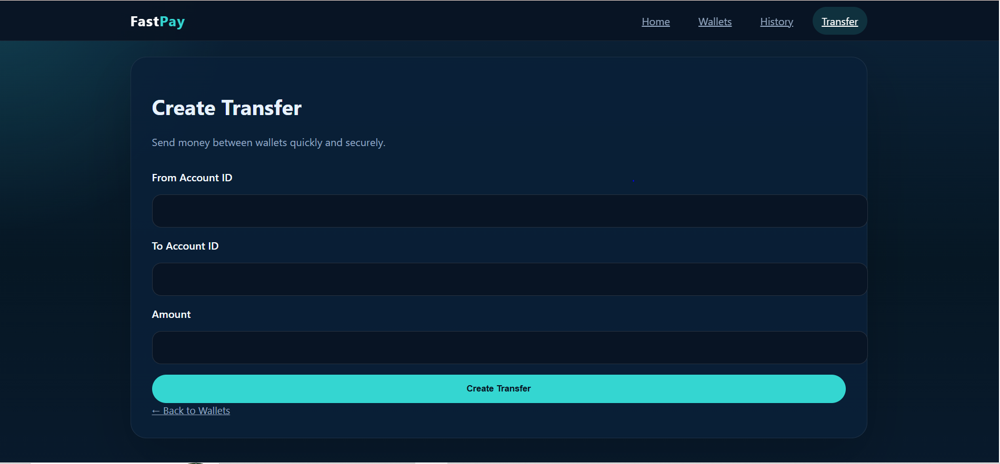
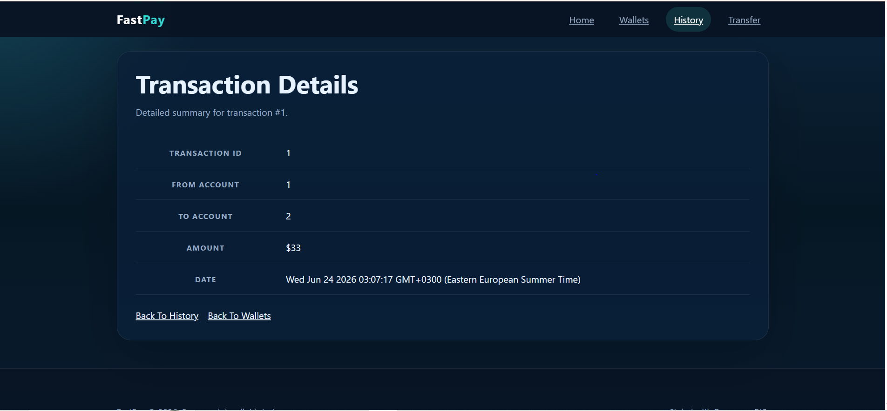

# FastPay — Mini FinTech Wallet

FastPay is a sleek mini wallet application built with Node.js, Express.js, and EJS. This repo demonstrates a clean separation of concerns across Routes, Controllers, Services, and Views, while showcasing a modern FinTech interface.

## Features

### Wallet Management

* View all wallets
* View wallet details
* Create new wallet accounts

### Transfers

* Create money transfers between wallets
* Validation rules:
  * Required fields are required
  * Amount must be greater than zero
  * Cannot transfer to the same wallet
  * Account IDs must be valid integers

### Transactions

* View transfer history
* View transaction details

---

## Screenshots

### Home Dashboard


### Wallets List


### Wallet Detail


### Transaction History


### Create Transfer


### Transaction Detail


---

## Project Structure

```text
mini-fintech-wallet
│
├── controllers
│   ├── acountsController.js
│   └── transferController.js
│
├── services
│   ├── accountsService.js
│   └── transferService.js
│
├── routes
│   ├── accountsRoutes.js
│   └── transferRoutes.js
│
├── data
│   ├── accounts.js
│   ├── transactions.js
│   └── transfers.js
│
├── public
│   └── styles.css
│
├── views
│   ├── createTransfer.ejs
│   ├── createwallet.ejs
│   ├── index.ejs
│   ├── transactionDetail.ejs
│   ├── transactionHistory.ejs
│   ├── viewwallets.ejs
│   ├── walletdetails.ejs
│   └── partials
│       ├── footer.ejs
│       └── header.ejs
│
├── screenshots
│   ├── createtransfer.png
│   ├── history.png
│   ├── home.png
│   ├── transactiondetail.png
│   ├── walletdetail.png
│   └── wallets.png
│
├── app.js
├── package.json
└── README.md
```

---

## Tech Stack

* Node.js
* Express.js
* EJS
* JavaScript

---

## Architecture

```text
Request
   ↓
Route
   ↓
Controller
   ↓
Service
   ↓
Data
   ↓
Response/View
```

---

## Learning Objectives

This project was created to practice:

* Express routing and middleware
* Controllers and services pattern
* EJS templating and rendering
* Form submission and validation
* UI styling with static assets
* FinTech wallet and transaction flows

---

## Future Improvements

* PostgreSQL integration
* Authentication and authorization
* JWT-based API security
* Enhanced balance validation
* Transaction status tracking
* REST API versioning
* Full mini digital banking system

---

## Run Project

Install dependencies:

```bash
npm install
```

Start application:

```bash
node app.js
```

Open browser:

```text
http://localhost:3000
```
